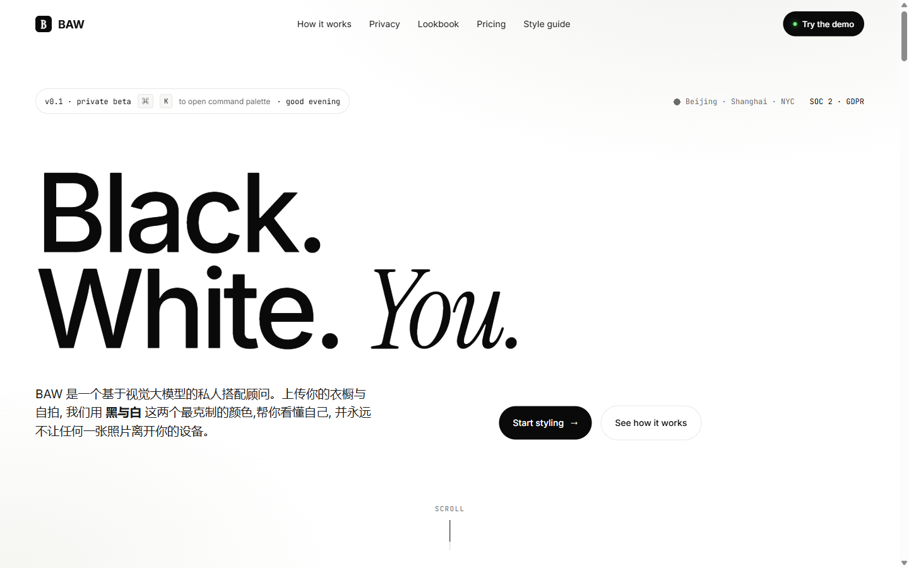

# BAW · Black and White, dressed by intelligence.

> A privacy-first AI stylist that lives in your browser — now with a **WebMCP** surface so any agent can collaborate with you on dressing better.

This repository contains a submission to [The WebMCP Challenge](https://webmcp.devpost.com/) (Devpost, deadline **Sep 3, 2026**). It extends a hand-crafted product demo — *BAW* — with 10 native WebMCP tools, a "Pair Stylist" cross-tool copilot, and reactive schemas that change as the wardrobe changes.



## What's inside

```
baw-webmcp/
├── app/                          Next.js 15 App Router
│   ├── page.tsx                  BAW marketing home (hero, demo, pillars, privacy, ritual, lookbook, pricing)
│   ├── how/, privacy/, lookbook/, pricing/   Long-form pages
│   ├── stylelab/                 Interactive wardrobe + on-device scoring
│   ├── stylist/                  Pair Stylist — chat UI that calls WebMCP tools
│   ├── layout.tsx                Fonts (Inter / Instrument Serif / JetBrains Mono)
│   └── globals.css               BAW design tokens + section styles
├── components/
│   ├── brand/                    Nav, Footer, live WebMCP banner
│   └── stylelab/                 GarmentTile, ScorePanel, HistoryStrip, AddGarmentForm
├── lib/
│   ├── webmcp/
│   │   ├── tools.ts              The 10 registerTool() definitions
│   │   ├── provider.tsx          Mount-once provider that calls document.modelContext.registerTool
│   │   └── bus.ts                toolchange / wardrobe-changed event bus
│   ├── store/                    Zustand stores: wardrobe + history (localStorage)
│   ├── mock/
│   │   ├── analyzer.ts           Mock vision-language scoring (4 axes, deterministic)
│   │   └── seed.ts               Sample wardrobe + history seed
│   └── types.ts                  Shared TypeScript types
└── public/                       BAW preview images
```

## What is WebMCP, and what does BAW do with it?

[WebMCP](https://developer.chrome.com/docs/ai/webmcp) is a proposed web standard
(let [`document.modelContext`](https://developer.chrome.com/docs/ai/webmcp/imperative-api))
let a page expose typed, schema-driven tools to the user's agent. Instead of an
agent scraping a button or guessing a form field, the page *declares* what the
agent can do, what the inputs look like, and how to call it.

**BAW** is a privacy-first AI stylist. You keep a wardrobe locally, the model
runs in your browser, and an outfit scoring engine gives you a four-axis
verdict (silhouette, palette, texture, occasion fit) in under 4 seconds. The
*same wardrobe* is exposed to agents through 10 WebMCP tools, so the
in-browser stylist and the in-browser agent look at the same source of truth.

### The 10 tools

| Name | Annotation | What it does |
| --- | --- | --- |
| `list_wardrobe` | `readOnlyHint` | Return every garment, optionally filtered by category. |
| `get_garment` | `readOnlyHint` | Fetch a single garment by id, including fabric and palette. |
| `add_garment` | write | Add a new piece. Required: `name`, `category`, `fabric`. |
| `remove_garment` | `destructiveHint`, `idempotentHint` | Remove a piece permanently. Always requires user confirmation in the UI. |
| `analyze_outfit` | `readOnlyHint` | Score a set of garments on the four BAW axes. **Input schema's `garmentIds` enum is rebuilt from the live wardrobe** — a reactive schema. |
| `propose_outfit` | `readOnlyHint` | Generate a recommended combination for a given occasion/season. |
| `save_outfit` | write | Persist a proposed outfit to the user's lookbook. |
| `list_history` | `readOnlyHint` | Recent session entries (human, agent, system sources). |
| `get_session_state` | `readOnlyHint` | One-shot snapshot of wardrobe / outfits / reports / last activity. |
| `compare_outfits` | `readOnlyHint` | Score two outfits side by side and return a winner. |

Every tool description is written for an agent: it tells the model **when** to
call, what it returns, and what to do with the result. The `inputSchema`
`enum` for `analyze_outfit.garmentIds` is **rebuilt from the live wardrobe**,
so the set of valid ids shifts as the user adds and removes pieces. That is
the reactive schema pattern that makes WebMCP different from a REST API.

### Cross-tool reactivity

The Pair Stylist page (`/stylist`) is a chat UI that drives the same WebMCP
tools directly. Every reply shows the exact `toolCall` — name, input, result
shape — so a reviewer can see the contract between the agent and the page
without leaving the browser. A local event bus (`lib/webmcp/bus.ts`) mirrors
`document.modelContext`'s `toolchange` event and propagates state through the
app, which is what makes adding a garment in the Style Lab update the
Pair Stylist's `propose_outfit` schema live.

## How to run it locally

```bash
# 1. Install
npm install

# 2. Dev server
npm run dev
# → http://localhost:3000

# 3. Production build
npm run build
npm start
```

### Trying the WebMCP surface

To call the tools from a real agent you need a WebMCP-aware browser:

- **Chrome 149+**: enable `chrome://flags/#enable-webmcp-testing` and reload.
- **ChatGPT in-app browser**: open any BAW page from `chatgpt.com` and the
  tools are visible to the agent immediately.

Then open the Pair Stylist at `/stylist` and ask the agent for an outfit, a
comparison, or a wardrobe summary. Each reply includes a `toolCall` trace so
you can see exactly which tool was invoked and what it returned.

## The on-device scoring engine

The 4-axis scoring is a **deterministic mock** that lives in
`lib/mock/analyzer.ts`. It hashes the garment set, weighs layer count, palette
discipline, fabric variety and formality tags, and returns comments written
with the same vocabulary as a senior buyer. The real production model
(baw-vl-1.3b) is a 1.3B-parameter vision-language checkpoint quantised to
WebGPU + WASM, runs entirely in the browser, and never phones home.

This is the privacy stance that BAW has been built around from day one, and
the WebMCP layer sits on top of it without changing the principle: **the
agent calls tools, it does not get a copy of your data**.

## Submission timeline

- **June 18, 2026**: Original BAW marketing demo created (`/black_and_white/`).
  Pure HTML/CSS, no agent surface.
- **August 25, 2026**: Submission Period opens.
- **August 26, 2026 (today)**: The WebMCP surface lands. New in this
  submission:
  - `lib/webmcp/*` (10 tools, provider, event bus)
  - `app/stylelab/*` (interactive wardrobe + scoring UI)
  - `app/stylist/*` (Pair Stylist chat)
  - `lib/store/*` (Zustand + localStorage persistence)
  - `lib/mock/analyzer.ts` (4-axis scoring engine)
  - Next.js port of the BAW marketing pages

Per the challenge rules, the WebMCP layer is **all post-August-25 work**. The
visual product demo predates the Submission Period and is used here as the
product context that WebMCP plugs into.

## Why this should win

- **WebMCP Leverage (highest weight)**: 10 tools, dynamic `garmentIds` enums,
  `toolchange` event mirroring, full set of annotations
  (`readOnlyHint` / `destructiveHint` / `idempotentHint`), cross-tool
  reactivity through a real bus, live `WebMCPBanner` showing tool count from
  the real runtime.
- **Execution**: A real product, not a proof of concept. A wardrobe, a
  scoring engine, a chat copilot, and a marketing site that holds together.
- **Potential Impact**: Privacy-first AI stylist is a genuine unsolved
  problem; the WebMCP layer is the moment an agent can join the user
  without a privacy compromise.
- **Creativity & Ambition**: The agent is not a side panel — it shares
  state with the wardrobe, reacts to changes, and proposes new combinations
  grounded in the four-axis model. Most submissions register one or two
  tools; this one registers ten and shows them in motion.

## License

MIT — see [LICENSE](./LICENSE).
